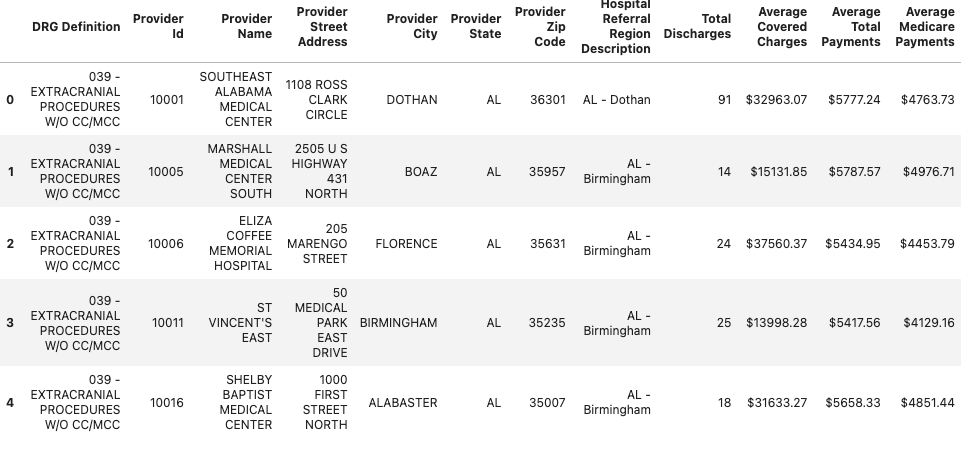
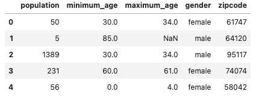

<h1> ETL process for Inpatient Charges & Demographics </h1>

##  Extract
### Inpatient
The inpatient data set is a .csv file that contains over 163K rows. The data included provider information, inpatient count, diagnostics and the average covered, total and medicare charges.  

  

### Population Data
The population data set is a .csv file and it was extracted to pandas data frame. The file had over 1.6M rows. Each zip code has multiple age groups split by gender. It also included subtotals for male, female and total for each zip code. 

  

### Income
The income data set is a .csv file that contains over 32K rows. It had statistics on income (mean, median etc. ) for select zip codes.  

  

## Transform

### Inpatient

The data set was normalized to a Provider data set and Inpatient charges data set. The headers had spaces which were removed using pandas .str.replace() method. The Zip_Code was renamed to zipcode to match other datasets using pandas .rename(columns={}) method. Some of the columns had "$" attached to the numbers which had to be removed and the number was type casted to float to enable load operation to the Postgres database.

### Population

The population database had subtotals for the male and female population count which had to be removed to avoid triple counting during grouping operations. The  subtotals were removed using pandas .dropna() method.  

### Income

The income database had inconsistent entries for all rows of type "track" and they were dropped. A number of columns that were not relevant such as location (lat, lon) were dropped from the original data set. The Zip_Code header was renamed to zipcode to match other data sets.  

## Load

ERD diagram was created to define the tables, primary & foreign keys and relationships as shown below. 

The tables were uploaded to Postgres database using create_engine module from sqlalchemy and pandas .to_sql() method. 

 

