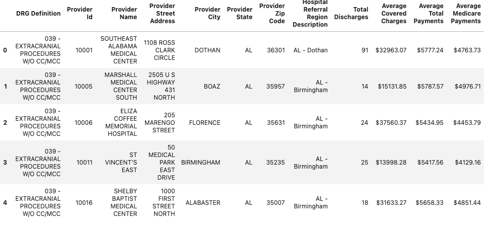
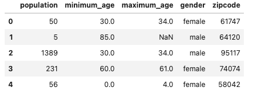

<h1> ETL process for Inpatient Charges & Demographics </h1>

##  Extract
### Inpatient
The inpatient data set is a .csv file that contains over 163K rows. The data included provider information, inpatient count, diagnostics and the average covered, total and medicare charges.  

  

### Population Data
The population data set is a .csv file and it was extracted to pandas data frame. The file had over 1.6M rows. Each zip code has multiple age groups split by gender. It also included subtotals for male, female and total for each zip code. 

  

### Income

## Transform

Those subtotals were removed using pandas .dropna method 

## Load